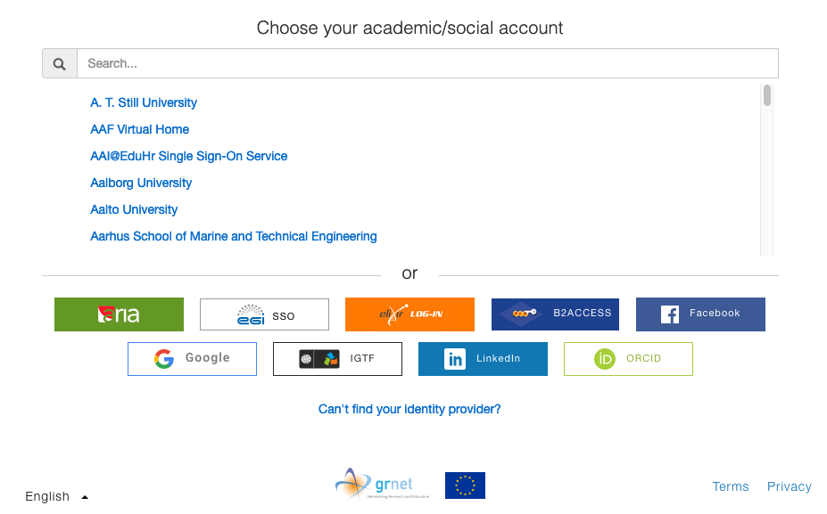
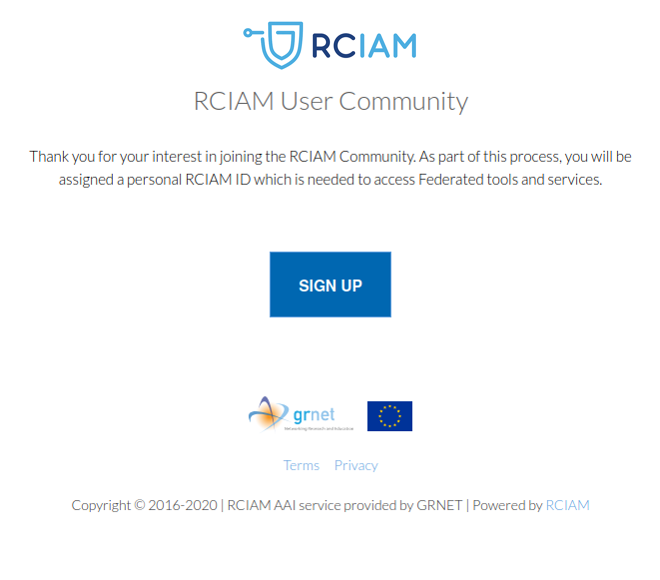

# Sign up

## Sign up for a RCIAM Account

You need to sign up for an account for accessing the RCIAM services. As part of
this process you will be assigned a personal unique **RCIAM ID** which will be
then used across all RCIAM tools and services. Follow the instructions below to
get started:

1. Go to <https://rciam.example.org/signup>. This will show you the identity provider
   discovery page: browse through the list of Identity Providers to find your
   Home Organisation, _or, alternatively,_ type the name of your Home
   Organisation in the search box. Note that the names are localised based on
   the selected language.

   

2. Enter your login credentials to authenticate yourself with your Home
   Organisation

3. After successful authentication, you may be prompted by your Home
   Organisation to consent to the release of personal information to the **RCIAM
   AAI Service Provider Proxy**.

4. After successful authentication, you will be redirected to the RCIAM account
   registration form. On the introductory page, click **Begin** to start the
   registration process.

   

5. RCIAM requires some basic information from you, depending on the attributes
   released by your Identity Provider, you may need to provide the values of the
   missing attributes.

   

6. On the registration form, click **Review Terms and Conditions**

7. If you agree to the Terms of Use, select the **I Agree** option.

   {} You will not be able to agree
   to the terms until you review them. {}

   

8. Finally, click **Submit** to submit your request.

   {} You will not be able to
   submit your request until you agree to the terms. {}

9. After submitting your request, RCIAM will send you an email with a
   verification link. After you click that link, you'll be taken to the request
   confirmation page.

   {} If you do not find the email
   in your Inbox, please check your Spam or Junk folder for an email from "RCIAM
   AAI Notifications". If you do find the email in these folders, mark the email
   as "safe" or "not spam" to ensure that you receive any future notifications
   about your RCIAM ID. {}

10. After reviewing your request, click **Confirm** and re-authenticate yourself
    using the Identity Provider you selected before.

11. In the case of the **Sign Up** registration, you need to wait for an RCIAM User
    Sponsor to approve your request to join the RCIAM User Community. Upon
    approval, RCIAM AAI will send you a notification email.

Note: After your registration has been completed, you can manage your profile
through the [RCIAM Account Registry portal](https://rciam.example.org/registry).

## Viewing user profile information

The profile includes all the information related to the user. This information
can be categorised as follows:

### Basic profile

Includes the basic information about your profile:

- Name
- Identifiers
- Email addresses

### VO/Group membership and roles

Includes information about the Virtual Organisations and groups the user if
member of and the roles assigned to the user within those Virtual Organisation.

### Linked identities

Information about identites linked to your account. Check the
[guide for linking accounts](../user/linking) for more information.

